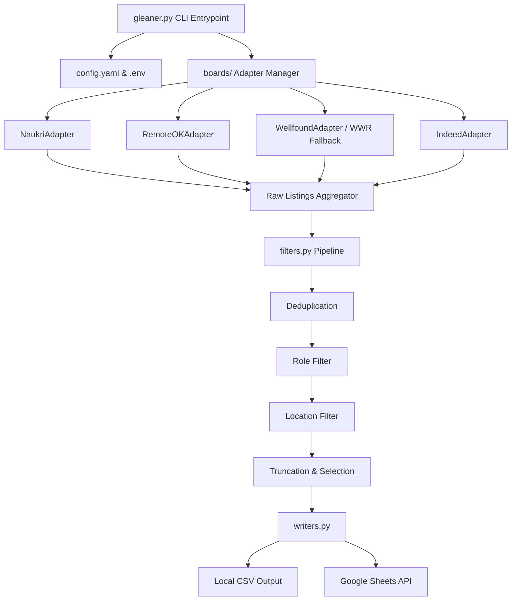

# Gleaner (`gleaner-job-scout`)

Gleaner is a highly modular, multi-board job scraper and aggregation pipeline. It enables developers, recruiters, and job seekers to query multiple job boards concurrently, deduplicate and filter the results using custom matching strategies, and write the cleaned listings to a local CSV file or publish them directly to a Google Sheet.


> [!NOTE]
> For a detailed, step-by-step setup and search execution guide, please refer to the [User Manual](file:///c:/My%20Projects/Job%20Scraping/user_manual.md).

---

## Features

- **Multi-Board Scaping**: Supports **Naukri**, **RemoteOK**, **Wellfound** (with RSS fallback via WWR), and **Indeed** using clean Adapter patterns.
- **Robust Scraper Integration**: Employs Firecrawl structured extraction and stealth configurations, custom bot user-agents (`GleanerBot/1.0`), and HTML parsing fallback solutions.
- **Deduplication & Filtering**: Fully pipeline-driven normalization containing:
  - Exact/similarity deduplication across sources.
  - Role relevance filtering using normalized keyword search.
  - Location matching.
- **Dual Outputs**: Outputs cleanly structured data to standard CSVs and integrates with the Google Sheets API for automated cloud sheets synchronization.
- **Configurable Settings**: Centrally control defaults, logging levels, formatting, and query limits via a structured YAML configuration.

---

## Architecture Diagram



---

## Installation & Setup

### 1. Clone the Repository
```bash
git clone https://github.com/sdn9300/gleaner-job-scout.git
cd gleaner-job-scout
```

### 2. Install Dependencies
Make sure you have Python 3.10+ installed. Install the required libraries:
```bash
pip install -r requirements.txt
```

### 3. Environment Configuration
Create a `.env` file in the root directory. You can base it on `.env.example`:
```ini
FIRECRAWL_API_KEY=your_firecrawl_api_key_here
GOOGLE_SERVICE_ACCOUNT_JSON=credentials/service_account.json
INDEED_PUBLISHER_ID=your_optional_indeed_publisher_id
```

> [!IMPORTANT]
> If you plan to sync results to Google Sheets, place your Google service account credentials JSON file inside a directory named `credentials/` (e.g., `credentials/service_account.json`). This directory is ignored by git to protect your credentials.

---

## Configuration (`config.yaml`)

Manage default limits, logging formats, and enabled crawlers directly inside [config.yaml](file:///c:/My%20Projects/Job%20Scraping/config.yaml):

```yaml
boards:
  - naukri
  - remoteok
  - wellfound
  - indeed

limits:
  default: 100

logging:
  level: INFO
  format: "%(asctime)s - %(name)s - %(levelname)s - %(message)s"
```

---

## Usage

You can run Gleaner via command-line arguments using [gleaner.py](file:///c:/My%20Projects/Job%20Scraping/gleaner.py).

### Command Arguments
- `--role` (Required): The job title or key terms to look up.
- `--location` (Required): Target geographic location or "remote".
- `--limit` (Optional): Maximum number of rows to export.
- `--output` (Optional): Local output path for CSV. Defaults to `jobs.csv`.
- `--sheet` (Optional): The destination Google Sheet URL.
- `--boards` (Optional): Comma-separated list of boards to crawl. Defaults to `"all"` (runs all configured boards).

### Examples

#### Basic Local Scraping (to CSV)
```bash
python gleaner.py --role "python developer" --location "Bangalore" --output results.csv
```

#### Scraping Specific Boards & Exporting to Google Sheets
```bash
python gleaner.py --role "data scientist" --location "Remote" --boards "remoteok,wellfound" --sheet "https://docs.google.com/spreadsheets/d/your-spreadsheet-id/edit"
```

---

## Code Base Structure

- [gleaner.py](file:///c:/My%20Projects/Job%20Scraping/gleaner.py): CLI Entry point, parses command inputs, orchestrates pipeline execution.
- [boards/](file:///c:/My%20Projects/Job%20Scraping/boards): Directory containing concrete scrapers implementing `BoardAdapter`.
- [filters.py](file:///c:/My%20Projects/Job%20Scraping/filters.py): Implements deduplication and filtering functions.
- [writers.py](file:///c:/My%20Projects/Job%20Scraping/writers.py): Handles local writing to CSV and authentication/writing to Google Sheets.
- [config.yaml](file:///c:/My%20Projects/Job%20Scraping/config.yaml): YAML-based configuration for defaults.

---

## Contributing & License

Feel free to open issues or submit pull requests to add adapters or expand pipeline filters!

This project is licensed under the MIT License.
